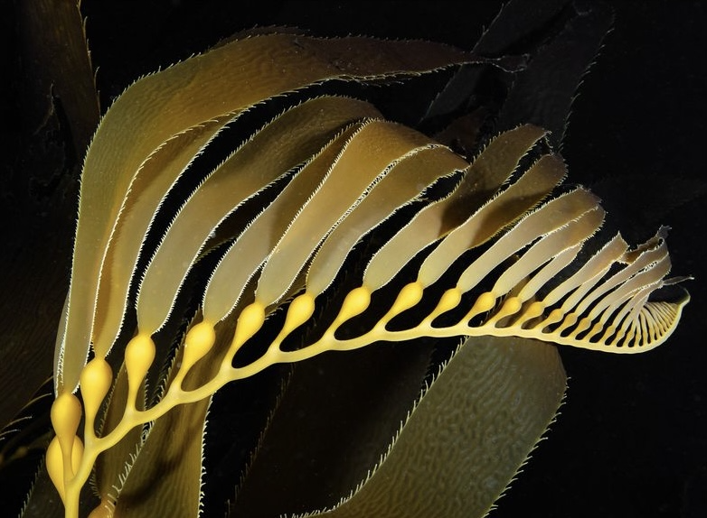
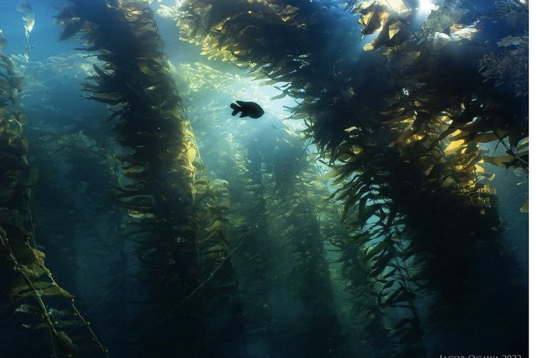

## **Kelp Forest Community Dynamics App**

---------------------------------------------------------------------------------------------------------------------------------
This app uses a collection of data from Santa Barbara Channel Long Term Ecological Research (SBC-LTER)'s ongoing long-term experiment of kelp removal (LTE KR). The experiment goal is to identify ecological consequences of increasing storm disturbance on the structure and health of a kelp forest community. Our app explores how kelp removal and the frequency of kelp removal may affect fish populations,invertebrate populations, and net primary production. The photos below are all of the SBC and were captured by Jacob Ogawa. 

 
      

---------------------------------------------------------------------------------------------------------------------------------

 
 

**Data information:** SBC-LTER was established in 2000 to better understand the ecology of kelp forests in this regions. SBC-LTER is based at the University of California, Santa Barbara and LTE KR is just one of many projects that are exploring how kelp forests are responding to a changing environment. LTE KR takes place at 5 different sites in the SBC over the course of 12 years. Increased disturbance in simulated using three treatments. The first being a control in which no kelp is removed and is only subject to natural processes that result in kelp removal. In the annual removal treatment kelp is removed once a year in the winter. In the continuous removal treatment kelp is removed every season (4x a year). Changes in kelp forest structure is measured with species diversity and abundance surveys. Changes in kelp forest function is measured with primary production of understory algae and detrital accumulation. Surveys are complete 1-2 times a season by the SBC-LTER scientific diving team. Click on the links below to learn even more!

1. Reed, D. 2021. SBC LTER: Reef: Long-term experiment: Kelp removal: Fish abundance ver 20. Environmental Data Initiative. https://doi.org/10.6073/pasta/18408185dc13be279c20b2afcd8cb842. Accessed 2022-03-10. 

2. Reed, D, R. Miller. 2021. SBC LTER: Reef: Long-term experiment: Kelp removal: Invertebrate and algal density ver 18. Environmental Data Initiative. https://doi.org/10.6073/pasta/b8c0201a94fd6cb91ed4c1ce574d89f2. Accessed 2022-03-10.

3. Reed, D, R. Miller. 2021. SBC LTER: Reef: Long-term experiment: Kelp removal: Urchin size frequency distribution ver 21. Environmental Data Initiative. https://doi.org/10.6073/pasta/fd564dddfe7b77fe9e4bd8417f166057. Accessed 2022-03-10.

 
 
---------------------------------------------------------------------------------------------------------------------------------

### **Meet the app developers!**

* Renee LaManna:
[Renee] (https://renlamanna.github.io/244_website/) is curretly a first year Master student at [Bren School of Environmental Science and Management, UCSB] (https://bren.ucsb.edu/people/renee-lamanna). She is specialization in Coastal Marine Resource Management and is interested in human interaction with the environment, especially in urban areas. She hopes to also gain experience in the energy sector and human transition to renewable. During her spare time, she'll be in the water, reading, or cooking new dishes!

* Yutian Fang:
[Yutian](https://tinafang-1207.github.io/) is currently a first year Ph.D. student at [Bren School of Environmental Science and Management, UCSB](https://bren.ucsb.edu/people/yutian-fang). Her research interest generally focuses on the intersection between marine spatial planning, fishery management and marine conservation. Her specific research direction right now is to explore the potential of dynamic ocean management to reduce fishery bycatch. During her spare time, she enjoys listening to music, watching TV shows, reading, chatting with her family and friends, and also walking by the beach of Santa Barbara. 

