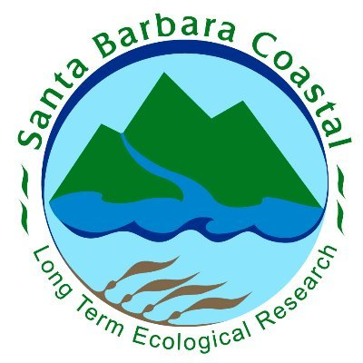

# **Welcome!**

This app uses a collection of data from Santa Barbara Channel Long Term Ecological Research (SBC-LTER)'s ongoing long-term experiment of kelp removal (LTE KR). The experiment goal is to identify ecological consequences of increasing storm disturbance on the structure and health of a kelp forest community. Our app explores how kelp removal and the frequency of kelp removal may affect fish populations,invertebrate populations, and net primary production. 

---------------------------------------------------------------------------------------------------------------------------------

### **More about the data used...**

SBC-LTER was established in 2000 to better understand the ecology of kelp forests in this regions. SBC-LTER is based at the University of California, Santa Barbara and LTE KR is just one of many projects that are exploring how kelp forests are responding to a changing environment. LTE KR takes place at 5 different sites in the SBC over the course of 12 years. Increased disturbance in simulated using three treatments. The first being a control in which no kelp is removed and is only subject to natural processes that result in kelp removal. In the annual removal treatment kelp is removed once a year in the winter. In the continuous removal treatment kelp is removed every season (4x a year). Changes in kelp forest structure is measured with species diversity and abundance surveys. Changes in kelp forest function is measured with primary production of understory algae and detrital accumulation. Surveys are complete 1-2 times a season by the SBC-LTER scientific diving team. 

 
 

 
 
-----------------------------------------------------------------------------------------------------------------------------------

### **About the app developers!**

